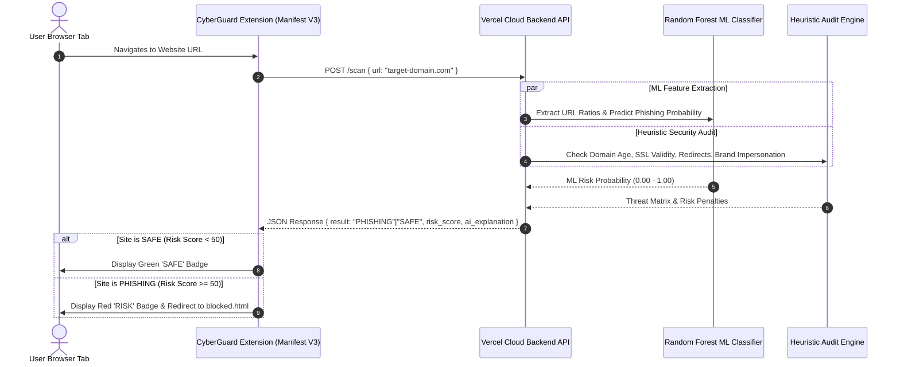

# 🛡️ CyberGuard — Real-Time AI Phishing & Threat Protection Engine

[](https://cyber-guard-rouge.vercel.app/)
[](https://flask.palletsprojects.com)
[](https://scikit-learn.org)
[](https://developer.chrome.com/docs/extensions/mv3/intro/)

**CyberGuard** is a real-time AI web security platform and browser protection engine. It combines Machine Learning URL classification, heuristic threat intelligence, automated WHOIS/SSL security audits, and a Manifest V3 browser extension to detect and block phishing sites instantaneously.

🔗 **Live Application:** [https://cyber-guard-rouge.vercel.app/](https://cyber-guard-rouge.vercel.app/)

---

## 💻 Tech Stack

| Layer | Technologies & Tools |
| :--- | :--- |
| **Frontend** | HTML5, Modern Glassmorphism CSS3, JavaScript (ES6+), FontAwesome |
| **Backend API** | Python 3.10+, Flask, Flask-CORS, Gunicorn, `io.BytesIO` In-Memory Streams |
| **Machine Learning** | Scikit-Learn (`RandomForestClassifier`), Joblib, Pandas, NumPy |
| **Browser Extension** | Chrome & Firefox Extension (Manifest V3), Service Worker API, Chrome Storage |
| **Security Auditing** | WHOIS Protocol (`python-whois`), SSL/TLS Handshake Analyzer, BeautifulSoup4 |
| **Cloud Hosting** | Vercel Serverless Functions (`vercel.json`) |

---

## 🔄 System Architecture & Workflow



---

## ⚡ Key Capabilities & Security Checks

- 🤖 **Random Forest ML Classification**: Trained on extensive URL feature sets analyzing URL character length, subdomain entropy, raw IP usage, special symbol ratios, and brand impersonation vectors.
- 🔍 **Multi-Vector Threat Inspection**:
  - **SSL Certificate Verification**: Validates SSL/TLS handshake security and expiration.
  - **WHOIS Domain Age Audit**: Detects newly registered disposable domains (< 30 days old).
  - **Brand Impersonation Detection**: Identifies lookalike domains mimicking major services (PayPal, Google, Apple, Microsoft, etc.).
  - **Redirect Chain Tracker**: Traces multi-hop redirect masks used by phishing kit hosts.
  - **Login Form & Download Payload Analyzer**: Detects unauthorized login forms and executable downloads (`.exe`, `.scr`).
- 💡 **AI Threat Explanations**: Generates plain-language risk breakdowns explaining why a site was flagged.
- 🧩 **1-Click Extension Package**: Dynamic server-side in-memory ZIP builder (`/download-extension`) allowing instantaneous user installation.

---

## 📁 Repository Structure

```
Cyber_Guard_/
├── backend/                        # Flask Security Backend API
│   ├── app.py                      # REST endpoints & serverless handler
│   ├── features.py                 # URL feature extraction pipeline
│   ├── security_checks.py          # WHOIS, SSL, redirect & threat audit engine
│   └── phishing_model.pkl          # Trained Random Forest Model
├── extension/                      # Manifest V3 Browser Protection Extension
│   ├── manifest.json               # Extension configuration (Chrome/Firefox)
│   ├── background.js               # Service worker real-time tab listener
│   ├── popup.html / popup.js       # Extension UI popup scanner interface
│   └── blocked.html                # High-risk phishing warning page
├── static/                         # Cyberpunk/Glassmorphism CSS & Web Assets
│   └── style.css
├── templates/                      # Dashboard UI
│   └── index.html                  # Live Threat Intelligence Center
├── vercel.json                     # Vercel serverless deployment configuration
├── requirements.txt                # Python backend dependencies
└── README.md
```

---

## 🚀 Installation & Local Development

### 1. Run Backend Locally
```bash
# Clone the repository
git clone https://github.com/hari-krishnan427/Cyber-Guard.git
cd Cyber-Guard

# Install dependencies
pip install -r requirements.txt

# Start Flask Server
python backend/app.py
```
*App will run on `http://127.0.0.1:5000`.*

### 2. Install Browser Extension (Developer Mode)

1. Open Chrome and navigate to `chrome://extensions/` (or `edge://extensions/`).
2. Enable **Developer mode** (top-right toggle switch).
3. Click **Load unpacked** in the top-left menu.
4. Select the **`extension/`** folder from this project directory.
5. Pin **CyberGuard** to your browser bar for real-time web protection!

---

## 🌐 Live Cloud Deployment

* **Live App URL:** [https://cyber-guard-rouge.vercel.app/](https://cyber-guard-rouge.vercel.app/)
* **API Endpoint:** `https://cyber-guard-rouge.vercel.app/scan`

---

## 📜 License

Distributed under the MIT License. See `LICENSE` for more information.
